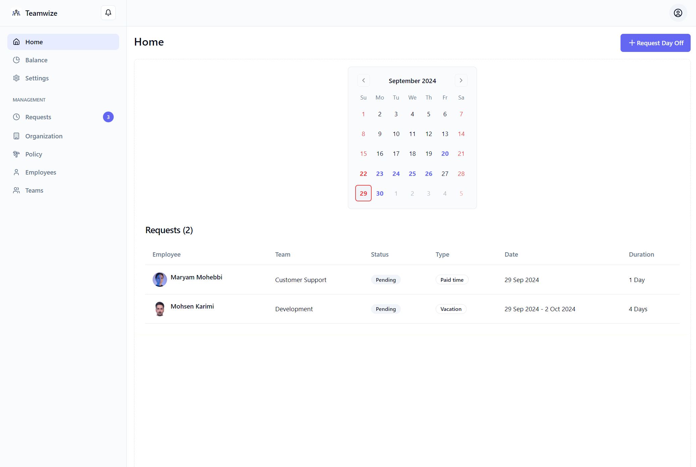
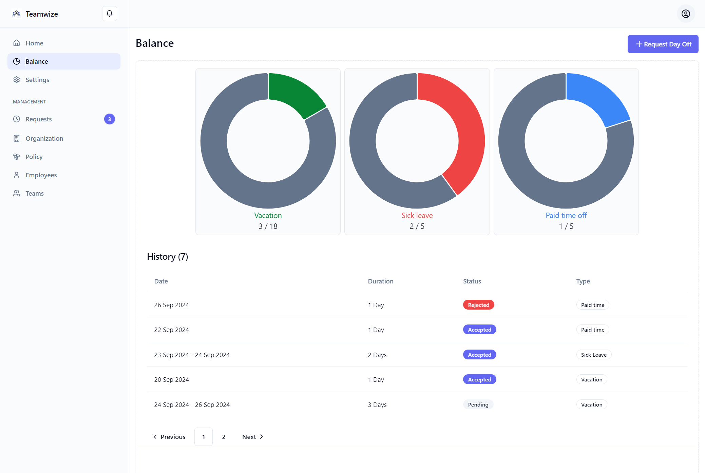
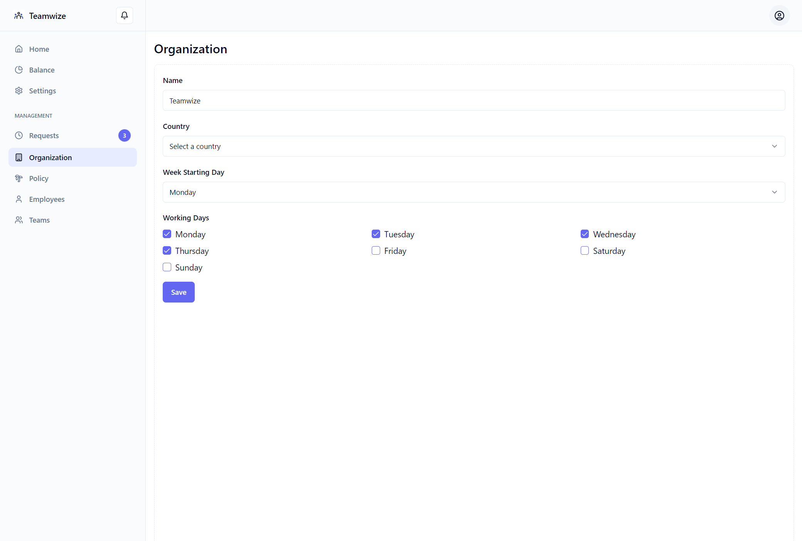

# Teampilot

## Introduction
Teampilot is an open-source **vacation tracker web application** built for small to medium-sized companies to efficiently manage and track employee time off. Admins can manage leave requests, employee details, and organization settings through a user-friendly interface.

## Features
- **Organization Management** (Admin Only): Admins can manage organization settings such as company details, week start day, and working days.
- **Leave Balance Configuration** (Admin Only): Admins can set the available leave days for different types (e.g., vacation, sick leave).
- **Employee Management** (Admin Only): Admins can add, edit, or remove employees and view their leave history. Employees log in using details set by the admin.
- **Team Management** (Admin Only): Admins can create and manage teams within the company.
- **Leave Request Management** (Admin Only): Admins can review and manage employee time-off requests by approving or rejecting them.
- **Calendar View**: Employees can view their own and other employees’ leave requests on a calendar, and submit new requests with the "Request Leave" button.
- **Leave Balance View**: Employees can check their available leave balance (e.g., vacation, sick leave) and review their leave history.
- **SettingsPage Management**: Employees can update their password and view a list of official holidays set by the
  admin.
- **Official Holidays Management** (Admin Only): Admins can set official holidays based on the year and country.
- **Activity Logs** (Admin Only): Admins can track all actions in the system, including leave requests, approvals, and leave balance changes.

## Technologies Used
- [React](https://react.dev/)
- [TypeScript](https://www.typescriptlang.org/)
- [Vite](https://vitejs.dev/)
- [React Router](https://reactrouter.com/en/main)
- [React Hook Form](https://react-hook-form.com/)
- [Zod](https://zod.dev/)
- [Shadcn UI](https://ui.shadcn.com/)
- [MUI](https://mui.com/)
- [Tailwind CSS](https://tailwindcss.com/)
- [Lucide Icons](https://lucide.dev/)

## Screenshots

|           |            |
|--------------------------------------------------------------|------------------------------------------------------------------|
|  |  |
|       |       |
|      |              |
|         |                                                                  |

## Quick Start
To run the project:
([link](https://github.com/teampilot-hq/backend?tab=readme-ov-file#getting-started))

## Contributing
We welcome contributions! To contribute:
- Fork the repository
- Create your branch (git checkout -b feature/YourFeature)
- Commit changes (git commit -am 'Add feature')
- Push the branch (git push origin feature/YourFeature)
- Create a Pull Request

## License
Licensed under the MIT License.

## Contact
For questions or support, please contact [rozita.hasani.work@gmail.com](mailto:rozita.hasani.work@gmail.com).
